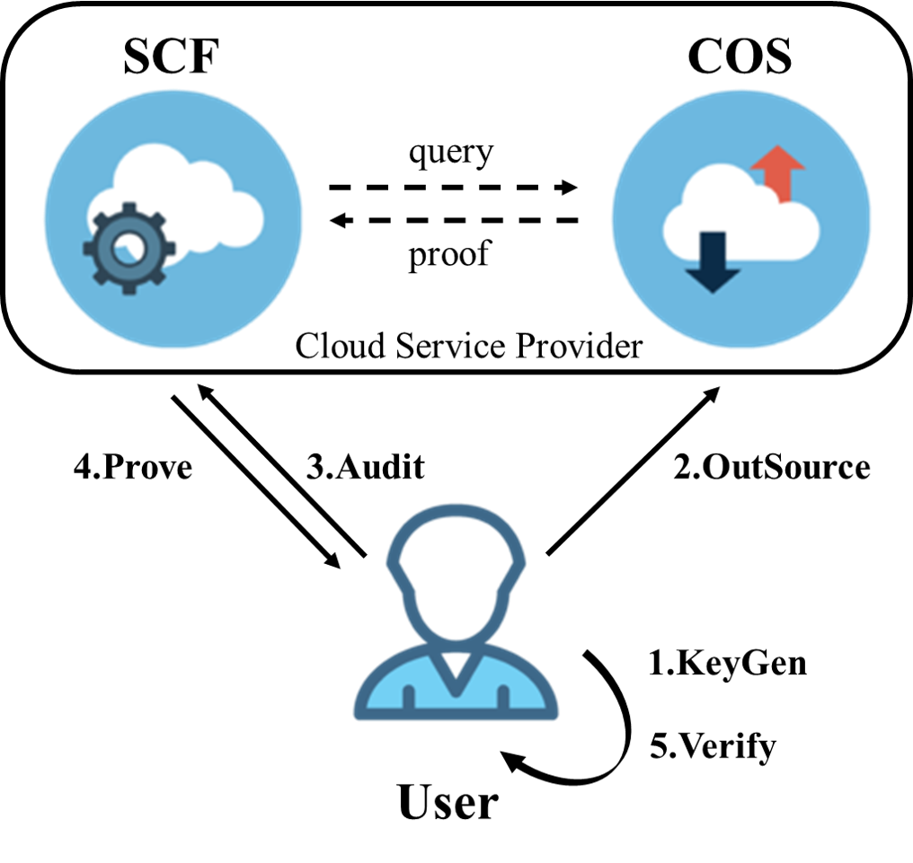

# Cloud Storage Auditing System Using Serverless Computing

使用不同的云服务平台实现的基于SCF的云审计服务。目前在腾讯云和AWS云上均可使用

下图是整个审计的基本流程，改图来自原文，可以帮助更好的理解整个执行流程

In the implementation, we also provide a [python script](https://github.com/jquanC/IntegrityCheckingUsingSCF/blob/master/challenge_length.py) to compute the challenge length `l` that is used by PDP scheme.

## Build

在pom文件中，有记录使用了哪些依赖，使用了腾讯云/AWS云的SDK，及java1.8构建环境。需要注意的是，由于我希望在打包的时候文件小一些，所以对AWS云的依赖是分别引入的，如果你需要其他基于AWS SDK的服务以拓展功能，你需要在官方文档上找到所需依赖，或者一次性全部引入(不推荐)
[pom.xml](https://github.com/jquanC/IntegrityCheckingUsingSCF/blob/master/pom.xml).

请一定要看看配置文件以避免冲突

## Usage

为了运行项目，你需要修改properties中腾讯云或亚马逊云的服务器秘钥及地区等配置，并且如果想要使用这些服务需要先在服务商处开通。你需要修改在Run文件夹中的AWSClient里的文件存储地址，他们分别为临时备份和源文件路径。之后点击运行即可。

## Contributing

感谢课题组，同时如果您有什么问题，欢迎与我联系。

